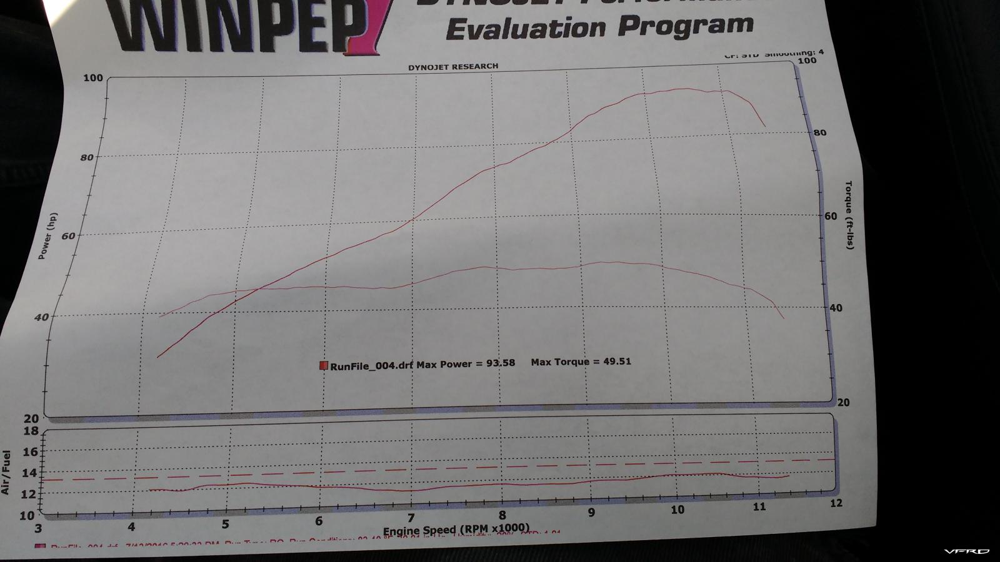

# Honda VFR750F (RC36-II) Engine Simulation

A detailed engine simulation of the **Honda VFR750F (RC36-II, 1994-1998)** built for [Ange's Engine Simulator](https://www.engine-sim.parts/).

Built from the author's own first bike — every effort was made to model the engine as accurately as possible using real specifications.

## Engine Specifications

| Parameter | Value |
|---|---|
| **Engine** | Honda VFR750F (RC36-II) |
| **Configuration** | 90° V4, DOHC, 16 valves |
| **Displacement** | 748 cc |
| **Bore × Stroke** | 70.0 mm × 48.6 mm |
| **Connecting Rod Length** | 101.5 mm |
| **Redline** | 10,500 RPM |
| **Rev Limiter** | 11,500 RPM |
| **Fuel** | Premium (max burning efficiency 0.925) |
| **Starter Torque / Speed** | 40 lb-ft @ 340 RPM |

## Valvetrain

| Parameter | Intake | Exhaust |
|---|---|---|
| **Valve Diameter** | 29 mm (2 per cyl) | 24.5 mm (2 per cyl) |
| **Cam Lift** | 8.0 mm | 7.5 mm |
| **Duration** | 232° | 225° |
| **Timing** | 15° BTDC / 37° ABDC | 35° BBDC / 10° ATDC |
| **Cam Advance** | 7° |

## Induction

- **Carburetors**: 36 mm Keihin (4x), cross-section 10.18 cm² each
- **Intake Plenum**

## Transmission & Drivetrain

| Component | Specification |
|---|---|
| **Clutch Max Torque** | 80 lb-ft |
| **Gear Ratios** | 2.846, 2.062, 1.631, 1.333, 1.153, 1.035 |
| **Final Drive Ratio** | 5.454 |
| **Tire Radius** | 32.79 cm |

## Vehicle

| Parameter | Value |
|---|---|
| **Mass (bike + rider)** | 226 kg + 65 kg |
| **Drag Coefficient** | 0.82 |
| **Frontal Area** | ~0.512 m² |
| **Rolling Resistance** | 29.03 N |

## Ignition

- Electric CDI with progressive timing curve
- Advances from ~10° BTDC at idle to ~37° BTDC near redline
- Firing order mirrors the real VFR's 90° V4 layout

## Files

| File | Description |
|---|---|
| `honda_vfr750.mr` | Full engine, transmission, and vehicle model |
| `750dyno.jpg` | Reference dyno chart |
| `README.md` | This file |

## Usage

Open `honda_vfr750.mr` in [Engine Simulator](https://www.engine-sim.parts/) to run the simulation.

## Disclaimer
- AI only for the readme
